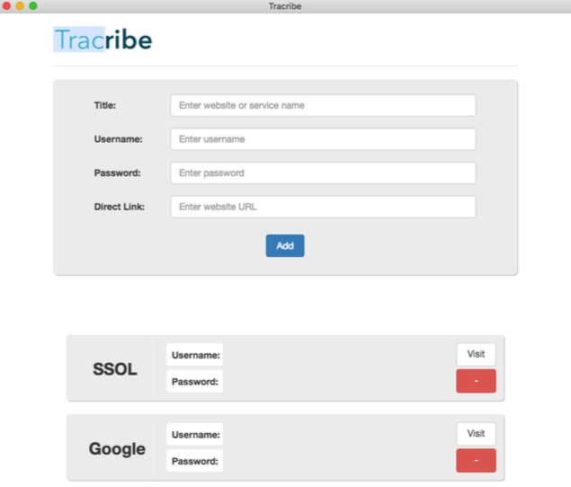

# Tracribe - store subscriptions info locally

Simple application for keeping track of your personal subscriptions
It uses localStorage for storing information(up to 5MB)

### Version
1.0.0

### Usage

npm run make - build the app and produce an executable

### Screenshot

